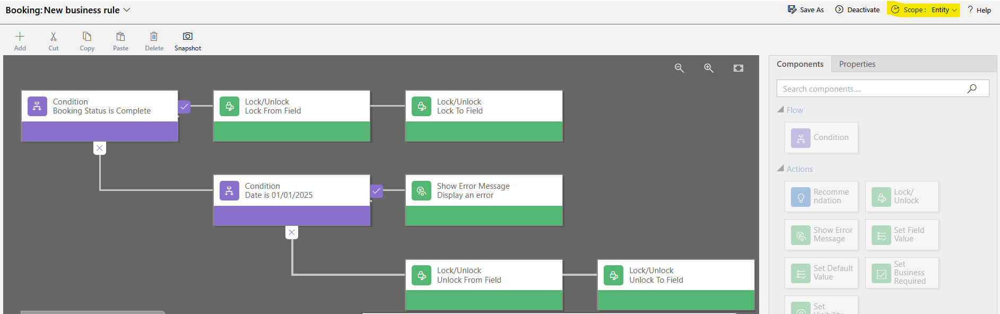
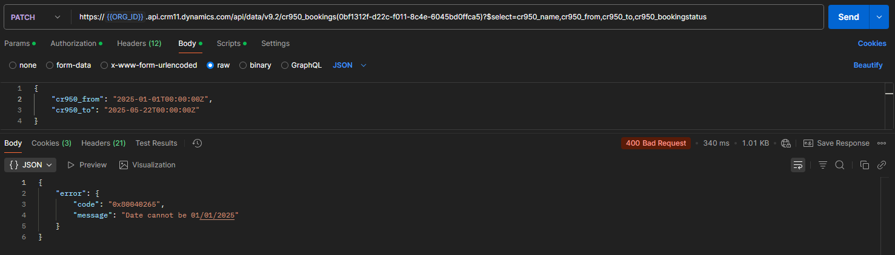
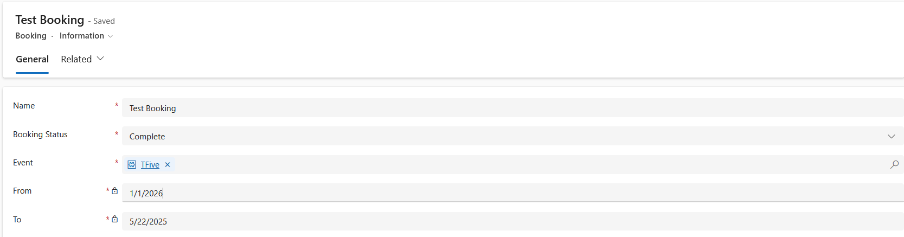
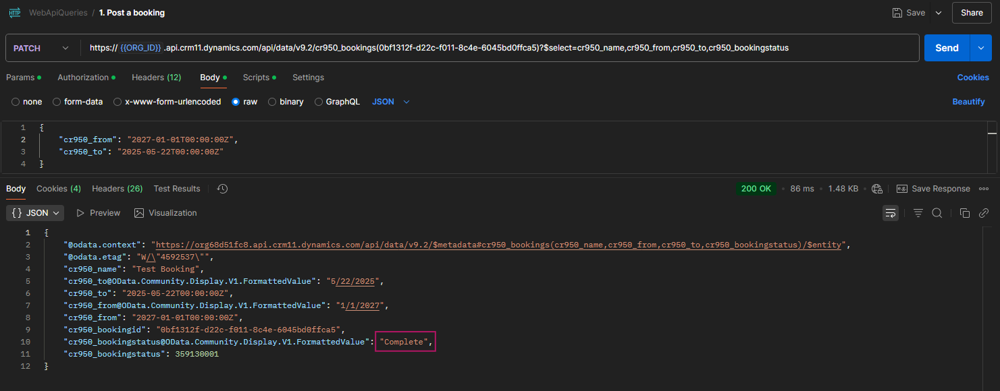

# Business Rules Lock Test

A business rule has been set-up with scope set to entity. There are three paths:

- Booking Status is Complete: Lock the To and From fields, ELSE,
  - Date is 01/01/2025: Show an Error message, ELSE
  - Unlock the to and From fields

When the conditions are met to show an error message, the action is run
server-side:

When conditions are met to lock the From and To fields, these fields are
read-only in the form:

However, the lock action does not prevent these fields from being updated using
the WebApi:

I can not find any information about this in the MS docs, the only reference to
this issue I can find is this old article:

<https://yanivrdt.wordpress.com/2016/08/12/entity-scope-business-rules-demystified/>
